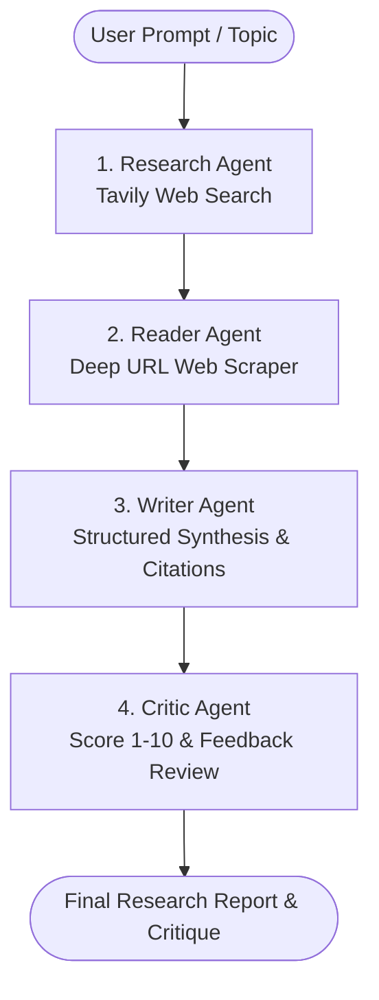

# Multi-Agent AI Research System 🔎🤖

An autonomous multi-agent research and synthesis pipeline powered by **Google Gemini** (`gemini-2.5-flash`), **LangChain**, and **Tavily Search API**. The system performs end-to-end research on any given topic—searching the live web, extracting deep page content, composing structured reports, and critically evaluating the final output.

---

## 🏗️ Architecture & Pipeline Flow

The system coordinates four specialized agents in an automated pipeline:



1. **Research Agent (Searcher)**: Queries the live web using Tavily API to gather relevant titles, URLs, and snippet summaries.
2. **Reader Agent (Scraper)**: Selects the most pertinent URL and extracts clean textual content (stripping navigation, scripts, and footers).
3. **Writer Agent (Synthesizer)**: Combines search snippets and scraped content into a well-structured research document featuring:
   - Introduction
   - Key Findings
   - Conclusion
   - Data Citations
4. **Critic Agent (Editor)**: Rigorously audits the report, providing an unbiased numerical score (1–10), key strengths, areas for improvement, and a final verdict.

---

## 🚀 Features

- **Multi-Agent Orchestration**: Modular agent separation for retrieval, parsing, synthesis, and review using LangChain.
- **Up-to-Date Live Web Access**: Leverages Tavily Search to access real-time web data and recent advancements.
- **Interactive Web UI**: Built with Streamlit, displaying step-by-step progress, live logs, expandable research data, and downloadable reports.
- **CLI Mode**: Run research directly in your terminal for headless or scriptable workflows.

---

## 📦 Project Structure

```text
├── agents.py           # Agent definitions, prompts, chains (Gemini 2.5 Flash)
├── app.py              # Streamlit web application
├── pipeline.py         # Sequential execution pipeline & CLI runner
├── tools.py            # Custom LangChain tools (Tavily search & BeautifulSoup scraper)
├── requirements.txt    # Python dependencies
├── .env.example        # Environment variable template
└── README.md           # Project documentation
```

---

## 🛠️ Getting Started

### 1. Prerequisites
- Python 3.10+
- [Google AI Studio API Key](https://aistudio.google.com/) (`GEMINI_API_KEY`)
- [Tavily API Key](https://tavily.com/) (`TAVILY_API_KEY`)

### 2. Clone the Repository
```bash
git clone https://github.com/sanil2050/Multi-Agent-Ai-Research-System.git
cd Multi-Agent-Ai-Research-System
```

### 3. Set Up Virtual Environment
```bash
python -m venv .venv
# On Windows PowerShell:
.venv\Scripts\Activate.ps1
# On macOS/Linux:
source .venv/bin/activate
```

### 4. Install Dependencies
```bash
pip install -r requirements.txt
```

### 5. Configure Environment Variables
Create a `.env` file in the root folder:
```bash
cp .env.example .env
```
Populate your API keys inside `.env`:
```env
GEMINI_API_KEY=your_gemini_api_key_here
TAVILY_API_KEY=your_tavily_api_key_here
```

---

## 💻 Usage

### Run via Streamlit UI (Recommended)
```bash
streamlit run app.py
```
Open your browser at `http://localhost:8501`, enter a research topic, and click **Start Research**.

### Run via Terminal (CLI)
```bash
python pipeline.py
```
You will be prompted to enter a topic, and the pipeline will stream its output to the terminal.

---

## 🛡️ License
This project is open source and available under the [MIT License](LICENSE).
